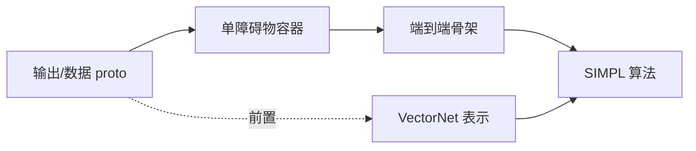

# 宏观拆分：领域/目标 → 子主题 DAG

> **定位**：这是「学什么、按什么依赖学、先学哪块」的**宏观规划工作流**，独立于单主题深读流程（见 `source_selection.md` → `prereq_and_objectives.md` → `qa_note.md` → `qa_to_archive.md` → `note_to_textbook.md` → `to_review_cards.md`）。
> **配套**：每个节点用 `background.py topic-upsert` 写进 `topics` 表（真相源；schema 见 `background_db.md`）；hub 视图由 `topic-render` 生成、总览看板由 `board` 生成——不再手写占位 hub。
> **衔接 collect**：本步拆出的 theme 是"目标明确但材料待获取"。每个节点带一个 `source_hint`（候选材料方向种子），作为下游 `source_selection.md`（`collect` 步）的输入——由它把 theme 收敛成"确定的、范围可控的资料清单"，再进 `prereq_and_objectives.md` 抽 `S_need`。

---

## 0. 目标（一句话）

把一个**大而模糊的学习目标**，拆成一张**有依赖、有 ROI、可并行**的子主题地图，让"先学哪块、哪块能并行、哪块可砍"一目了然，并直接写进 `topics` 表（`topic-upsert`，可进入深读流程）。

**两个不可动摇的落点：**
- **拆成 DAG，不是拆成线性清单**：节点之间标清依赖（谁是谁的前置），而不是排成一条流水。线性周计划是这张图的"切片"，不是它本身。
- **每个节点对齐真实定位与 ROI**：拆分服务于"用最短路径达到目标 + 符合当前阶段定位"，不是把领域百科式铺平。

---

## 1. 输入

- 一个领域 / 学习目标（必填）。
- 背景 `S_have`（`baseline.yaml` 基线 + `s_have` 表，`background.py have-query`；用于判断已具备 vs 需补、对齐阶段定位）。
- 可选：mentor 路线、时间预算、里程碑（如中期汇报时点）。

---

## 2. 拆分原则（依据，沿用作者既有方法论）

1. **目标驱动 / 主动取舍**：以"达成目标所必需"为准绳，与目标弱相关的分支主动标记为"本期不追"。
2. **认知顺序**：能看见的（输出/数据）→ 怎么流转（骨架）→ 怎么算（核心算法）→ 怎么闭环。具体先于抽象，数据结构先于算法。
3. **代码/任务驱动就近挂载**：工具补强（如现代 C++、多线程）不单独成块，挂在它真实出现的子主题上。
4. **对齐阶段定位**：标注每个节点与当前定位的关系（如"现阶段不写代码 → 某节点降级为'只认识'"）。

---

## 3. 产出

### 3.1 子主题节点表

| 字段 | 含义 |
|---|---|
| `topic` | 子主题名（将作为 hub 文件名与 obsidian `topic`） |
| `deps` | 前置子主题列表（DAG 的边） |
| `type` | 产物类型：论文精读 / 代码导读 / 工具补强 / 数据实操 |
| `roi` | high / mid / low（达成目标的边际收益） |
| `align` | 与阶段定位的对齐说明（含降级处理，如"只认识不深啃"） |
| `objective` | 一句话：学完这块要能做什么 |
| `source_hint` | 候选材料方向的**种子**（"大概去哪类材料找"，如某论文/某源码目录/某文档）。供下游 `source_selection.md`（collect 步）确定到"具体哪份+读哪部分"。**只给方向，不在此确定范围裁剪。** |

### 3.2 依赖图（Mermaid）



> 用实线表示"硬前置"，虚线表示"软参考/复习性前置"。

### 3.3 写入 topic 库（每个节点一条 topic-upsert）

每个节点落成一条命令写进 `topics` 表（不再手写 hub 文件；hub 是后续 `topic-render` 的视图）：

```powershell
python $env:LEARNING_PIPELINE\scripts\background.py topic-upsert SIMPL `
  --status planned --roi high --objective "讲清对称/instance-centric 表示" `
  --align "只到接口级，不深啃训练侧" `
  --deps VectorNet,prediction-proto `
  --source-hint "arXiv:2402.02519, modules/prediction 下 simpl_*" --tags prediction,motion-forecasting
```

`source` 字段等 `source_selection.md` 确定主材料后再 `topic-upsert --source <主材料名>` 补。字段含义见 `background_db.md §2`；**`align` 是下游 `source_selection.md` 判定取材深度的依据，务必填**。

---

## 4. 推进与边界

- **一次只拆一层**：先拆出 6–12 个一级子主题；某个节点过大时再对它单独跑一次本工作流向下拆，不一次拆到底（避免规划发散）。
- **切片产周计划**：从 DAG 上按依赖拓扑序 + 时间预算切出"本周吃得下"的一片，落成周/日计划（如 `第二周学习计划.md`）。本文件只负责图，不负责排时间表。
- **可砍顺序**：在节点表里预先标好 low-ROI / 可降级节点，进度落后时按此顺序砍，保住主干。

---

## 5. 开工前应确认

- 目标的"完成判准"是什么（如"能给 mentor 讲清主链路 + 对 case 判断好坏"）。
- 时间预算与里程碑。
- 是否有必须包含/必须排除的子主题。
